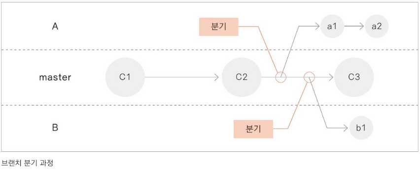

# Git&Github 입문 도서 (2)

상태: GitHub

# <2> 백업

## 브랜치 branch

새로운 기능을 추가했을 때, 제대로 동작한다는 확신이 없을 때를 위한 버전.

기존의 제대로 동작하는 소스는 그대로 둔 채, 추가한 버전을 따로 만들어 관리한 다음, 원래 소스에 더할 수 있는 버전 관리 시스템의 개념 중 하나다.

Git으로 버전관리를 시작하면 기본적으로 master branch가 만들어진다. 사용자가 commit할 때마다 master branch는 최신 commit을 가리킨다. 

## branch 분기하기 & 병합하기

새 branch를 만들면 기존에 저장한 파일을 master branch에 그대로 유지하면서 기존파일 내용을 수정하거나 새로운 기능을 구현할 파일을 만들 수 있다. 이렇듯 master branch에서 새 branch를 만드는 것을 '분기branch한다'고 한다.

새 branch에서 원하는 작업을 다 끝냈다면 원래 master branch에 합칠 수 있다. 이렇게 분기했던 branch를 master branch에 합치는 것을 '병합merge한다'고 한다.

## ★ 따라해보기

### 분기하기

### branch에서의 commit끼리의 관계 확인

### branch 사이의 차이점 확인

### 병합하기

위와 같이 충돌이 생긴 문서는 자동으로 병합될 수 없다.

따라서 사용자가 직접 충돌부분을 해결한 후에 커밋해야 한다.

