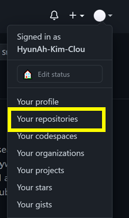

# Git&Github 입문 도서 (3)

상태: GitHub

# Github 원격 저장소



Github 홈페이지의 Your repositories에 있는 저장소들이 원격저장소다. 


## ★ 직접해보기

## 원격저장소(Github) 생성하기


## Github와 연결하기


## Github에 올리기 (push)


## Github에서 내려받기 (pull)

```bash
// 내려받을 위치로 이동
cd Documents

// github 연결
git init
git remote add origin https://github.com/Final-Univ-Project/Alarm-Module.git

// 내려받기
git pull origin master
```

# Github로 협업하기

# 여러 컴퓨터(집, 회사)에서 원격저장소 함께 사용하기

## clone으로 내려받기

clone: 원격저장소를 지역저장소에 똑같이 가져오기

```bash
// git clone 원격저장소url주소 지역저장소repo명
git clone https://github.com/Final-Univ-Project/Alarm-Module.git  git_home

// 복제된 원격저장소 자료 확인
ls -al
cd git_home
git log // commit 확인

// github 연결
git remote -v
```

## 집에서 작업하고 Github에 올리기

```bash
// 작업 중 

// Github에 올리기
git commit -am "editing at home"
git push
```

## 회사에서 내려받아 작업하고 올리기

```bash
// Github에서 내려받기
git pull

// 작업 중

// Github에 올리기
git commit -am "editing at company"
git push

// commit 로그 확인
git log
```

# 협업에서 branch사용하기

branch를 통해 작업물을 올립니다.

```bash
// 최신 commit정보 가져오기
git pull

// 새 기능 구현하기
// -b branch명 : 브랜치 생성하면서 체크아웃
git checkout -b add_alarm

// 작업 중

// Github에 올리기
git add .
git commit -m "add alarm function"
git push origin add_alarm
```

Github에서 확인하면 아직 파일이 반영되지 않은 것을 확인할 수 있습니다.

pull request를 통해 merge해야 Github에 반영이 됩니다.

1. branch설명 옆의 New pull request를 클릭
2. pull request 메시지 작성 
3. 전송

Github에 등록된 Pull request는 공동작업자 중 누구나 살펴보고 merge가능합니다.

1. pull request 메시지를 확인하여 문제가 없다면 Merge 클릭
2. 필요하다면 pull request를 남긴 사람과 메시지 주고받을 수 있음

위를 모두 마쳤다면 branch를 병합합니다.

Confirm merge 버튼을 통해 브랜치를 병합합니다.

# Github 설정하기


## README 파일 작성하기

저장소를 편하게 살펴볼 수 있도록 안내문을 만들어 첫 화면에 보여주는 문서입니다.

README 파일은 마크다운(markdown)문법을 사용하기 때문에 확장자는 .md를 사용합니다.

줄바꿈을 하려면 Enter를 두 번 눌러서 가운데 빈 줄을 넣어야 한다.