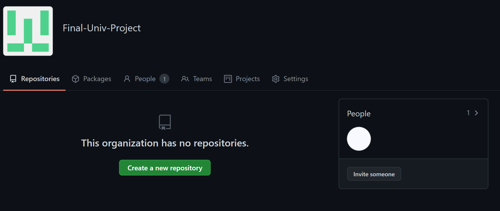

# G 팀 소스코드관리

상태: 공통_공부

[https://blog.naver.com/PostView.nhn?blogId=ahn128&logNo=221489301872&widgetTypeCall=true](https://blog.naver.com/PostView.nhn?blogId=ahn128&logNo=221489301872&widgetTypeCall=true)

# 1. Code 저장공간 생성

1. GitHub 홈페이지> 우측상단의 'New organization' 클릭
2. Free Plan ($0) 선택
3. 팀명, 이메일, Code저장공간 설정

# 2. Team Member 초대하기

1. 오른쪽의 'Invite someone' 클릭

    

2. user id 검색> Invite> Role(권한) 선택> Send invitation

# 3. Team 생성

1. Github Project Dashboard 페이지> 상단의 'Teams'> 'New team'

    

2. 팀명, 가시성(프로젝트 내, 팀 내) 설정

    

3. 왼쪽 패널에서 member 추가> user id 검색> Invite

